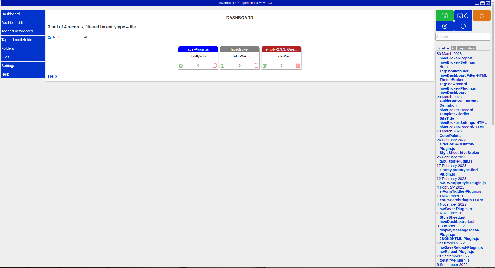

# hiveBroker the story
`hiveBroker` can be your starting point for all your classic TiddlyWiki's.\
TiddlyWiki classic is traditionally used in a browser like Firefox or Chrome or in [TiddlyDesktop](https://github.com/TiddlyWiki/TiddlyDesktop).\
[TiddlyDesktop](https://github.com/TiddlyWiki/TiddlyDesktop) provides a more application like look and feel, it runs on NW.js an is suited for TiddlyWiki classic and TiddlyWiki 5.\
Over the years saving a TiddlyWiki in a browser became more and more difficult and I started looking for something else.\
My starting point was that I only wanted to use classic TiddlyWiki's, on NW.js or Electron , with a very open architecture.\
First I wrote a very basic saver to use TiddlyWiki classic with NW.js. From a running TiddlyWiki classic on NW.js you can open another TiddlyWiki classic in a new window. The same as one would use tabs in a browser.\
Because I use several classic TiddlyWiki's I needed something to organize, categorize and find them with ease.\
The hiveBroker-Plugin.js makes this possible, this plugin can generate a tiddler with file information in it for all folders/files in selected folders on your drive.\
The generated tiddlers have buttons to do basic things like delete, rename, copy and start your classic TiddlyWiki.\
From the tiddlers a dashboard is generated that shows you bagdes for all classic TiddlyWiki's or files that you selected, by extension, badge color, tags and sorted by number of clicks.

> `hiveBroker` is still under development but breaking changes are not expected.

## Install
To install download a zip file of your choice, unpack and start by clicking on the nw or nw.exe.
`hiveBroker` uses the [nwSaver-Plugin.js](https://github.com/qbroker/nwSaver) for saving.

The dashboard looks like here below.
Or just try it here [hiveBroker-Plugin.js](https://qbroker.github.io/hiveBroker/).
Unfortunately saving and opening TiddlyWiki's does not work on GitHub pages.

### TiddlyWiki classic license
TiddlyWiki is Copyright 2013 UnaMesa Assocation
It is licensed under a BSD License. See [here](https://github.com/TiddlyWiki/tiddlywiki/blob/master/html/copyright.txt) for the exact terms.

### TiddlyWiki classic @ Google groups
https://groups.google.com/forum/#!forum/tiddlywikiclassic

### TiddlyWiki classic @ Github
https://github.com/TiddlyWiki/TiddlyWiki

### TiddlyWiki classic
https://classic.tiddlywiki.com/

Comments are appreciated and if you like this project, give it a :star: :star: :star:

Have a nice day, Okido
